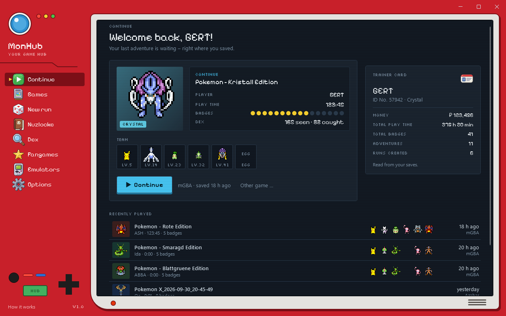
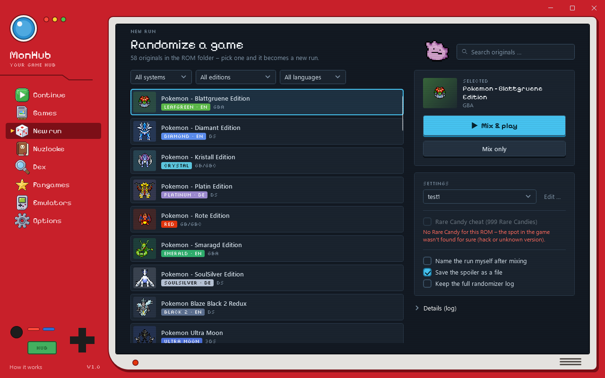
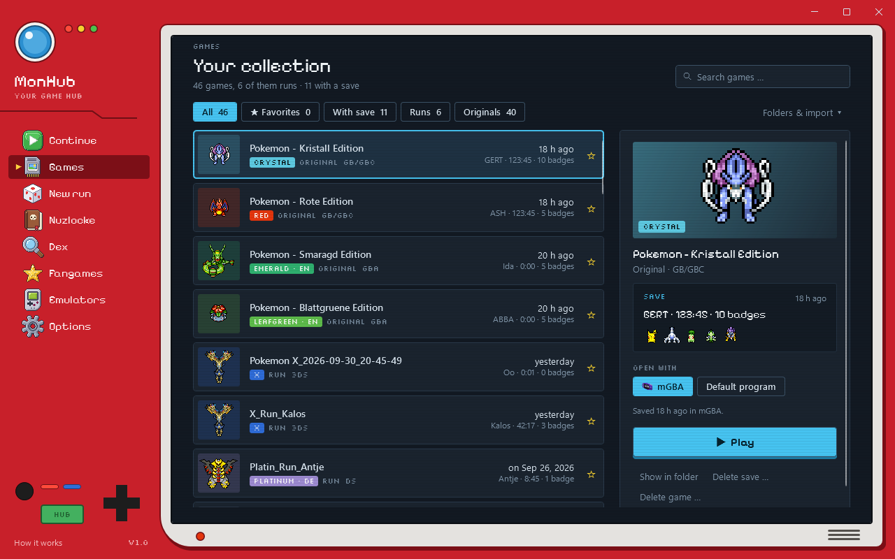
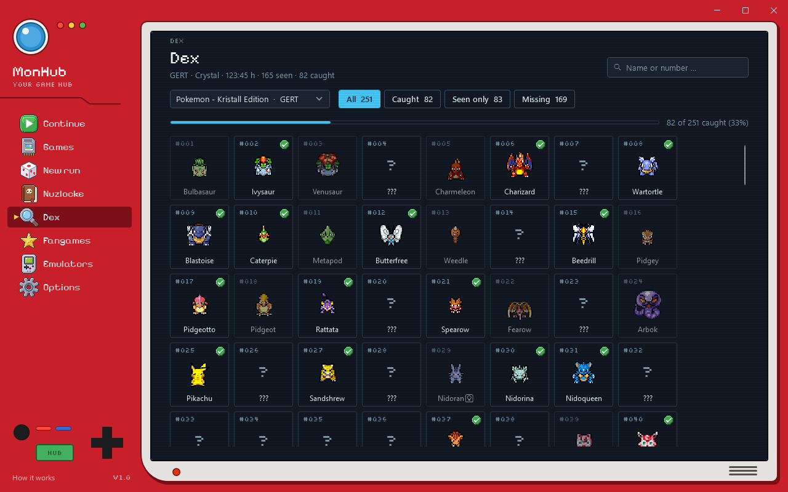
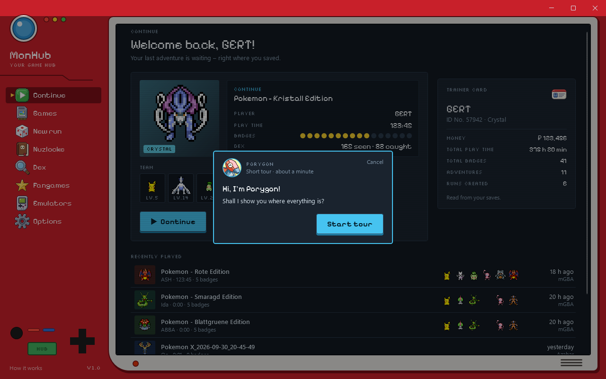
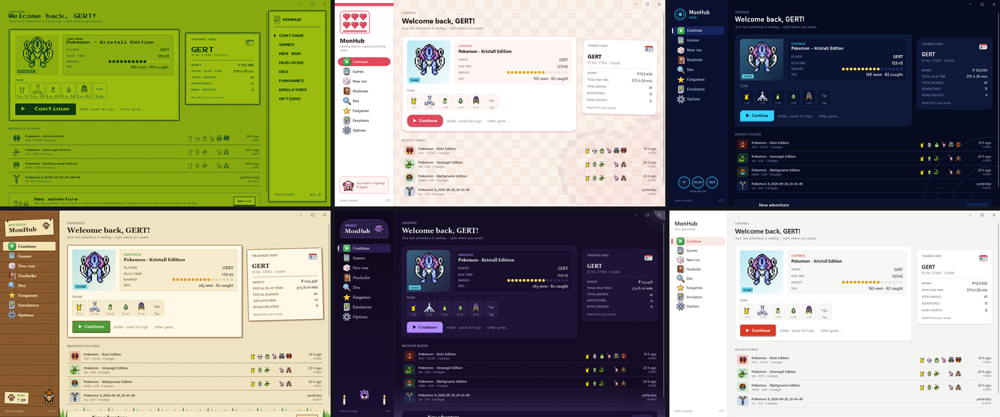

# MonHub

**Your game hub for randomizers, emulators and fangames – all in one window.**

MonHub is an app for **Windows and Linux** for anyone who wants to replay their own monster-catching games freshly randomized, without
fiddling with emulators, folders or settings: install once, import your ROMs, press “Mix & play”.
MonHub speaks **English** and **German** (switch under *Options*).

> **Unofficial fan project.** MonHub is not affiliated with Nintendo, Creatures, GAME FREAK or The Pokémon Company.
> Pokémon and all related names are trademarks of their owners. **MonHub includes no games (ROMs) and no BIOS** – only
> use copies of games you own.

## What MonHub does

- **New run:** pick an original, randomize, play – powered by the Universal Pokemon Randomizer ZX, with presets and a
  built-in editor for every option. Optional Rare Candy cheat. Four presets come with it: *Nuzlock with Items*
  (default), *Easy Wild and Starters*, *Hard Trainers* and *Chaos Everything*.
- **Emulators, ready to go:** melonDS / DeSmuME (DS; DeSmuME on Windows only), mGBA (Game Boy, Game Boy Color, GBA), Azahar (3DS) – shared key
  and controller mapping, a 60 FPS switch for 3DS games.
- **Continue:** your latest save with trainer, play time, badges and team – read straight from the save files of every
  generation (Gen 1–7).
- **Dex:** the Dex of every single save.
- **Nuzlocke tracker**, **fangames**, **import** of ROMs and saves from other emulators.
- Seven looks and a short tour with Porygon to get started.

| New run | Your games |
|---|---|
|  |  |
| **Dex** | **Tour with Porygon** |
|  |  |

**Seven looks** – Red, Retro, Pink, Neon, Savanna, Spooky and Plain:

## Install

Both downloads are on the [releases](../../releases) page. ROMs are not included – you need your own.

### Windows

1. Download `MonHub-Setup.exe` and run it – no admin rights needed.
2. The installer isn't signed, so Windows may show “Windows protected your PC”: click *More info* → *Run anyway*.
3. Pick the language and the folder (default: `%USERPROFILE%\MonHub`), finish, start MonHub from the Start menu.

Everything goes into that one folder. **Updating:** run the new `MonHub-Setup.exe` over the old install – ROMs, saves
and settings stay. They also stay when you uninstall.

### Linux

For a 64-bit (x86-64) Linux with a desktop; tested on Ubuntu 26.04 (GNOME) and Arch (KDE Plasma).

1. Download `MonHub-linux-x64.tar.gz` and unpack it where you want MonHub to live, e.g. your home folder:
   `tar xzf MonHub-linux-x64.tar.gz`
2. Run the installer once – in the file manager (right click `install.sh` → *Run as a program*) or in a terminal:
   `cd MonHub && ./install.sh`
   It unpacks the emulators and puts MonHub into your applications menu. Nothing is written outside the folder except
   that menu entry, and no root rights are needed.
3. Start MonHub from the applications menu.

melonDS, mGBA, Azahar and a Java runtime come with it; DeSmuME is Windows-only. **Updating:** unpack the new archive
over the old folder and run `install.sh` again – ROMs, saves and settings stay. If you move the folder, run
`install.sh` again. **Removing:** run `uninstall.sh`, then delete the folder (copy your ROMs and saves out first).

3DS games need a graphics card with Vulkan or OpenGL 4.3.

## FAQ

**Windows or my antivirus blocks the installer / says it's dangerous. Is it a virus?**
No. The installer isn't signed with a paid code-signing certificate and isn't downloaded often yet, so Windows
SmartScreen doesn't “know” it – that's what triggers “Windows protected your PC” (*More info* → *Run anyway*). Some
antivirus programs are also suspicious of installers that bundle emulators and a Java runtime. Everything MonHub does is
in this repository's source code, and the installer is built from it. To be sure your download wasn't tampered with,
compare its checksum with the one in the release notes: `Get-FileHash .\MonHub-Setup.exe` in PowerShell. If your
antivirus still quarantines it, please report it to the antivirus vendor as a false positive – don't switch your
antivirus off.

**Where do I get the games (ROMs)?**
Not from MonHub, and not from us – MonHub contains no games, and we don't link to ROM sites. Use copies of games you
own: dump your own cartridges or game cards (for example with a cartridge reader, or on a homebrew-enabled console).
Please don't ask for ROMs in the issues.

**Do I need a BIOS, firmware or 3DS keys?**
No. DS games run without a BIOS (encrypted US versions open in DeSmuME automatically); if you have dumps from your own
DS you can add them under *Emulators*. 3DS games must already be **decrypted** (.3ds/.cci/.cxi from your own console) –
MonHub doesn't decrypt anything and includes no keys.

**Which games work?**
The main series from Gen 1 to 7: Red/Blue/Yellow, Gold/Silver/Crystal, Ruby/Sapphire/Emerald, FireRed/LeafGreen,
Diamond/Pearl/Platinum, HeartGold/SoulSilver, Black/White 1+2, X/Y, Omega Ruby/Alpha Sapphire, Sun/Moon and Ultra
Sun/Ultra Moon – English and German versions are tested best. ROM hacks aren't supported by the randomizer, but you can
add them (or any fangame) under *Fangames*.

**Is MonHub free? Do donations unlock anything?**
It's free and stays free. Donations are a thank-you, nothing more – there are no paid features and nothing is behind a
paywall.

**Does it run on Linux, macOS or my phone?**
Windows 10/11 (64-bit) and 64-bit Linux (see *Install*). There is no macOS or phone version.

**Where are my saves? Are they safe when I update or uninstall?**
In the `Spielstände` folder inside the MonHub folder (*Options* → *Open folder*). Updates and uninstalling keep your
ROMs, saves, runs and fangames. Making a backup of that folder now and then never hurts.

**Can I keep playing my saves from another emulator?**
Yes: *Games* → *Folders & import* → *Import from emulator* copies ROMs and saves over (your old files stay untouched).

**A 3DS game runs way too fast.**
That's the 60 FPS cheat (smoother, but these games run at double speed with it). Hold **R** for normal speed, or switch
it off under *Emulators*.

**Can I use a controller?**
Yes, Xbox-style controllers work out of the box; change the buttons under *Emulators* → *Controls & speed*.

**The randomizer failed. What now?**
Open *Details (log)* on the *New run* page – it usually says which option the game doesn't support. Try another preset,
and if it keeps failing, open an issue with the log (but without the ROM).

**How do I update?**
Download the new `MonHub-Setup.exe` from the releases and run it – it installs over the old version and keeps
everything.

**Linux: a DS game doesn't start and MonHub asks for a BIOS.**
Some DS dumps (many US versions) are still encrypted. On Windows MonHub starts those in DeSmuME; on Linux there is no
DeSmuME, so melonDS needs your own DS BIOS files: *Emulators* → *Add BIOS …*. MonHub doesn't include a BIOS.

**Linux: my controller isn't found.**
MonHub reads controllers through `/dev/input/js*`. Plug the controller in (or connect it by Bluetooth) before you click
a controller field; if your distribution doesn't load the `joydev` module, run `sudo modprobe joydev`.

**How do I switch the language?**
*Options* → *Language* (English or German). MonHub restarts briefly.

## Build it yourself

MonHub is one code base for both systems (C#, [Avalonia](https://avaloniaui.net)).

Requirements: .NET 10 SDK, JDK 17 (`javac`, `jar`, `jlink`), Python 3 with Pillow; for the Windows installer also
Inno Setup 6 and 7-Zip.

1. Download [Universal Pokemon Randomizer ZX 4.6.1](https://github.com/Ajarmar/universal-pokemon-randomizer-zx/releases)
   and put its `.jar` into the repository's root folder (it is found by its checksum, the file name doesn't matter).
2. **Windows installer:** run `MonHub/installer/build.ps1`. The first time it downloads the pictures from PMD Sprite
   Collab and the fonts, then melonDS, DeSmuME, mGBA and Azahar from their official releases (each checked against a
   fixed SHA-256 sum), and builds `Installer/MonHub-Setup.exe`.
3. **Linux package:** run `python MonHub/installer/build-linux.py` (works on Windows and Linux, after step 2 or with
   the pictures already downloaded). It fetches the Linux builds of melonDS, mGBA and Azahar and a Java runtime, each
   checked against a fixed SHA-256 sum, and builds `Installer/MonHub-linux-x64.tar.gz`.

Tests: `dotnet test MonHub.Tests` (among others the save reader for every generation, checked against PKHeX, and both
languages).

The Pokémon pictures are deliberately **not** in the repository; `MonHub/tools/` downloads them from their
source. The menu icons are MonHub's own (`tools/build_icons.py`).

## License

MonHub is free software under the **GNU General Public License v3.0** – see [LICENSE](LICENSE).

Bundled programs (in the installer, each with its license):

| Program | License | Source code |
|---|---|---|
| Universal Pokemon Randomizer ZX | GPL-3.0 | https://github.com/Ajarmar/universal-pokemon-randomizer-zx |
| melonDS | GPL-3.0 | https://github.com/melonDS-emu/melonDS |
| DeSmuME | GPL-2.0 | https://github.com/TASEmulators/desmume |
| mGBA | MPL-2.0 | https://github.com/mgba-emu/mgba |
| Azahar | GPL-2.0 | https://github.com/azahar-emu/azahar |
| OpenJDK 17 (Microsoft Build) | GPL-2.0 with Classpath Exception | https://github.com/microsoft/openjdk |
| .NET Runtime | MIT | https://github.com/dotnet/runtime |

**Pictures:** the menu icons are drawn by MonHub itself (`tools/build_icons.py`); every Pokémon picture comes from
[PMD Sprite Collab](https://sprites.pmdcollab.org), released by its artists under
[CC BY-NC 4.0](https://creativecommons.org/licenses/by-nc/4.0/) – attribution, non-commercial. Who made which picture is
listed in [CREDITS.md](MonHub/CREDITS.md). Pictures marked “CHUNSOFT” are original graphics from
*Pokémon Mystery Dungeon* © Nintendo / Creatures / GAME FREAK / Spike Chunsoft. The screenshots above show such
pictures too.

**Fonts:** Silkscreen, Pixelify Sans, Press Start 2P – SIL Open Font License 1.1.

**Thanks** to PKHeX (save formats, for checking), PokeAPI (Pokémon and place names in both languages) and the cheat
collection CTRPF-AR-CHEAT-CODES (3DS addresses).

## Support

MonHub is and stays free, with no paid features. If you like it, you can support its development with a coffee –
voluntary, nothing in return: **[ko-fi.com/krogger](https://ko-fi.com/krogger)** ☕
